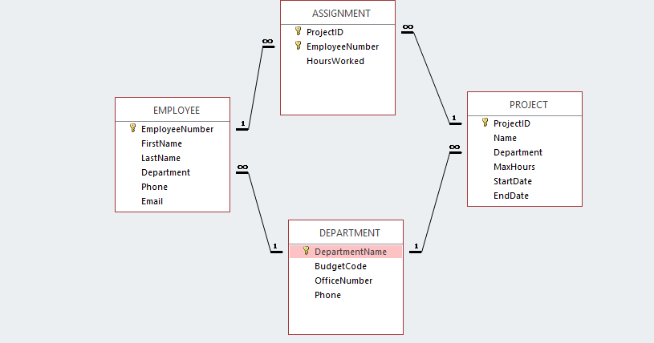

<h2> Connecting to the database </h2>

The first chunk in this Notebook will run automatically when you make the SQL statements. It loads the libraries you need and connects to the database 'WPC.db' that should be in your folder. 

```{r setup, , results='hide'}
library(tidyverse)
library(readxl)
library(DBI)

#enable other connections
# dbDisconnect(con)

# connect to CapeCodd
con <- DBI::dbConnect(RSQLite::SQLite(), "WPC.db")
#

#
# use the database connection for all SQL chunks in this notebook 
knitr::opts_chunk$set(connection = "con", echo=TRUE)
```


<h2> Using SQL to produce new data and R for visualization </h2>

You start every SQL chunk with the tag <code>{sql}</code>. See the chunks provided in your Notebook. The SQL statement <code>SELECT *</code> shows all rows in the table 'Project'. Using captital for the SQL keywords is common. It is not necessary. The semi-column is necessary in various databases. R will run without the semi-column, but make a habit our of it to end every SQL statement with the semi-column.

```{sql, connection=con, echo=TRUE}
SELECT
ProjectID, MaxHours
FROM
 Project;
```

We can capture the result of this sql code chunk in a R dataframe. We use <code> {sql, output.var = "df_result"}</code> at the beginning of the chunk to capture the results in the dateframe 'df_result'.


```{sql, connection=con, output.var = "df_result", echo=TRUE}
SELECT *
FROM Project;
```

Proceeding we can use this dataframe as input for ggplot. Use the <code>{r}</code> tag in your chunk to switch to regular R again. Let's visualize the MaxHours per project.

```{r, echo=TRUE}
ggplot(df_result, aes(ProjectID, MaxHours)) +
  geom_col()
```


<h2> database design </h2>

Below is the design of the database. You should have this picture in the images folder of your workdirectory. You can open the picture next to your Notebook, so that you can see the design while creating your queries.




<h2> learn about SQL </h2>
Besides the slides, more information can be found on:
https://www.w3schools.com/sql/
and https://bookboon.com/en/database-design-and-implementation-ebook

<h2> Assignments </h2>
Make a SQL query for the following questions. The desired result is printed below each question. Use ggplot visualization where asked. 

A.	What projects are in the PROJECT table? Show all information for each project.

```{sql, connection=con }
SELECT * FROM project

```
<br>
B.	What are the ProjectID, Name, StartDate, and EndDate values of projects in the PROJECT table?


```{sql, connection=con }
SELECT * FROM project
```
<br>
C.	What projects in the PROJECT table started before August 1, 2008? Show all the information for each project. (a date has format YYYY-MM-DD and is placed between single quotes)

```{sql, connection=con}
SELECT * FROM Project
WHERE StartDate < '2008-08-01'
```
<br>
D.	What projects in the PROJECT table have not been completed? Show all the information for each project.


```{sql, connection=con }
SELECT * FROM Project
WHERE EndDate IS NULL
```
<br>
E.	Which projects contain the word 'Q3' in the project name and have been started in august 2008? Show the project ID, project Name and Start Date. (Wildcards in SQLite are % for 0 or more characters and _ to match 1 character)


```{sql, connection=con }
SELECT Name, StartDate FROM Project
WHERE NAME LIKE '%Q3%' AND
StartDate LIKE '2008-08%'
```
<br>


F.	Make a list of all different first names of employees. Order them alphabetically from Z to A.

```{sql, connection=con }
SELECT DISTINCT(firstname) FROM Employee
ORDER BY firstname DESC
```
<br>
