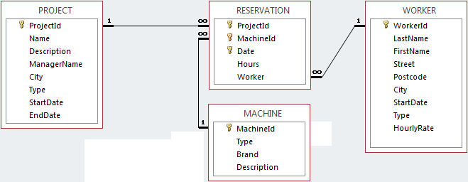

In part 3 you are prepared for your assesment with open assignments. This workbook provides the answers, so you can review your results.


<h2> Connecting to the database </h2>

The first chunk in this Notebook will run automatically when you make the SQL statements. It loads the libraries you need and connects to the database 'machine.db' that should be in your folder. 

```{r setup, results='hide'}
library(tidyverse)
library(readxl)
library(DBI)

#enable other connections
# dbDisconnect(con)

# connect to machine.db
con <- DBI::dbConnect(RSQLite::SQLite(), "machine.db")
#

#
# use the database connection for all SQL chunks in this notebook and hide the code by default
knitr::opts_chunk$set(connection = "con", echo=FALSE)
```


<h2>Database design </h2>

Below is the design of the database. You should have this picture in the images folder of your workdirectory. You can open the picture next to your Notebook, so that you can see the design while creating your queries.




<h2> Assignments </h2>

Make a SQL query for the following questions. 

a)	List all the projects that started in 2018 and ended in 2018.

```{sql, connection=con}
/*select * from project
where StartDate like '2018%'
and EndDate like '2018%'*/
SELECT * FROM WORKER
```
<br>

b)	Give the total number of workers that live in Eindhoven and have an hourly rate of more than 20 euros/hr.

```{sql, connection=con}
SELECT count(workerid) AS NumberOfWorkers FROM worker
WHERE city == 'Eindhoven' and
hourlyrate > 20
```
<br>

c)	List the projects where manager name is Jane plus the projects where city is not Eindhoven and manager name is not Jane.
```{sql, connection=con}
SELECT * FROM project
WHERE managername == 'Jane' or (managername != 'Jane' and city != 'Eindhoven')
```
<br>

d)	Give average hourly rate of all full-time Workers per city, but only when there are more than 1 worker coming from that city.
```{sql, connection=con}
SELECT City, avg(hourlyrate), count(workerid) AS Workers FROM WORKER
WHERE type == 'F'
GROUP BY(City)
HAVING Workers > 1
```
<br>

e)	Give first name and last name of the workers who have worked on projects with project ids between 2 and 6 (both values are inclusive) and who have first name ending with letters 'rd'. <u>Using a subquery is mandatory!</u>
```{sql, connection=con}
SELECT firstName, lastName FROM worker
where FirstName like '%rd'
and WorkerID IN
(SELECT Worker FROM RESERVATION
WHERE ProjectID between 2 and 6)
```
<br>

f)	Give the project name, project type, machine type, brand for the machines of type 'Loader', 'Roller' and 'Dumper'. Sort the result in alphabetical order of project type and then in reverse alphabetical order of machine type.
```{sql, connection=con}

SELECT p.name as ProjectName, p.type as ProjectType, m.type MachineType, brand as MachineBrand
FROM project p
INNER JOIN reservation r
ON p.ProjectID = r.ProjectID
INNER JOIN machine m
ON r.MachineID = m.MachineID
WHERE m.Type IN('Loader','Roller','Dumper')
ORDER BY ProjectType, MachineBrand DESC
```
<br>

g) List per machineID and description the number of projects that reserved that machine.
```{sql, connection=con}
select r.machineid, Description, count(projectid) as NumberOfProjects
from machine m, reservation r
where m.MachineID = r.MachineID
group by r.MachineID, Description


```
<br>

h) List for each reserved machine, the workers firstname and lastname that reserved that machine. 

```{sql, connection=con}
 select firstname, lastname, r.MachineID
 from WORKER w, RESERVATION r
 where r.Worker = w.WorkerID

```
<br>
