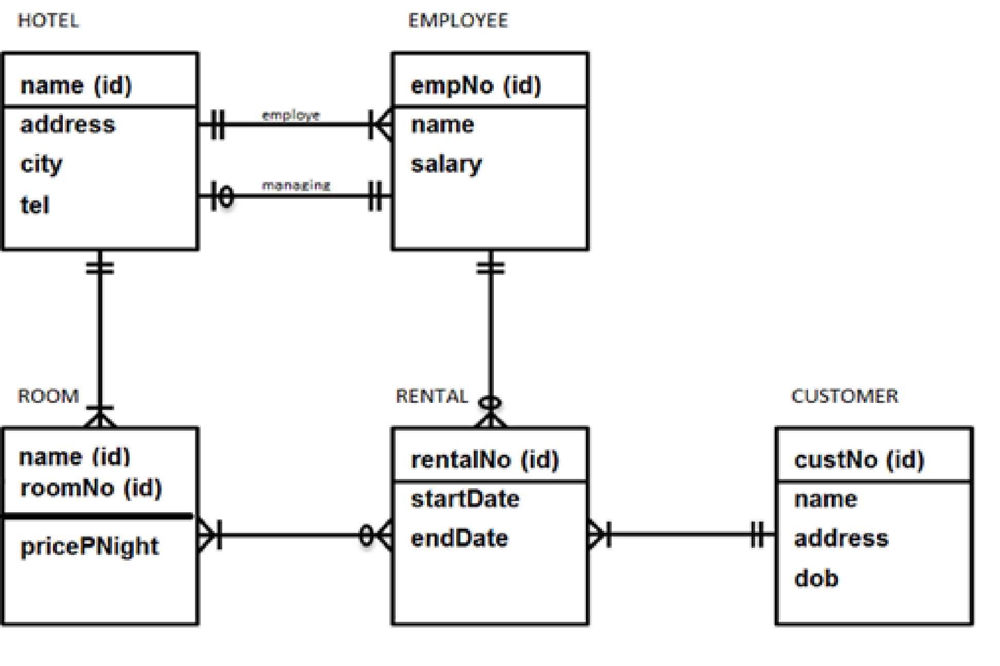
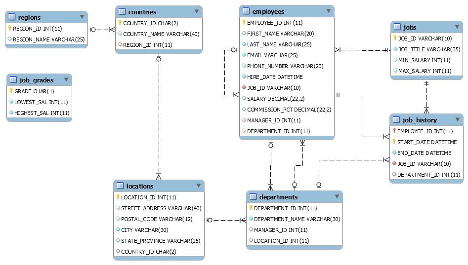

```{r setup, include=FALSE}
knitr::opts_chunk$set(echo = TRUE, error = TRUE)

library(tidyverse)
library(readxl)
library(DBI)
library(knitr)
library(kableExtra)


#enable other connections
# dbDisconnect(con)
#
# connect to CapeCodd
con <- DBI::dbConnect(RSQLite::SQLite(), "hr.db")
#

#
# use the database connection for all SQL chunks in this notebook and hide the code by default
knitr::opts_chunk$set(connection = "con", echo=FALSE)
```

## Week 10 Assignment DDO First Semester

In this assignment we will be looking at the content studied during the DDO course. We will focus especially on the meaning of certain queries. Some questions require only a SQL code, others will ask you to explain in plain English how the code works. The same explanation will go for the database relations. 

>Being able to explain a set of code in simple wording is a good skill for IT engineers, regardless of their field of work. In your professional career, you will have to explain to a layman how a certain code is working. In most cases, this will be your manager or CEO, who has no IT experience. Commands like SELECT, WHERE and GROUP BY will not be understood and need additional explanation. 

you are allowed to work in groups, making this workbook also ensures that you have all libraries for the individual test in week 12. (HINT make sure each member of the group can make the assignments.)
Good Luck...

### Reading a DataBase

Looking at the ERD, shown in figure 1, we can see 6 different relations, describe all six in plain english going from 1 to many.



Relation 1 *Customer - Rental*: One or more to exactly one

Relation 2 *Rental - Employee*: Zero or more to exactly one

Relation 3 *Rental - Room*: Zero or more to one or more

Relation 4 *Hotel - Room*: Exactly one to one or more

Relation 5 *Hotel - Employee (Employee)*: Exactly one to one or more

Relation 6 *Hotel - Employee (Managing)*: One or zero to exactly one

## SQL statements

Make an SQL query for the following questions. The desired result is printed below each question. Additionally in some question you need to provide an explanation of the code in plain English. Asume you have to discuss your result with a layman and he wants to understand what you have done.



Make an SQL query for the following questions. The desired result is printed below each question. 

A.	The HR department needs a report to display the employee number, last name, salary, and salary increased by 15.5% for each employee with an employee ID below 110. Label the column New Salary.

```{sql, connection=con, echo=TRUE, error = TRUE }
SELECT employee_id, last_name, salary, (salary * 1.155) AS new_salary from Employees
WHERE employee_id < 110

```

B.	Find the highest, lowest, sum, and average salary of all employees. Label the columns Maximum, Minimum, Sum, and Average, respectively. Round your results to the nearest whole number.

```{sql, connection=con, echo=TRUE, error = TRUE }
SELECT MAX(salary) AS Maximum, MIN(salary) AS Minimum, SUM(salary) AS Sum, ROUND(AVG(salary)) AS Average
FROM Employees

```

C.  Explain in plain english the following code. 

```{sql connection=con, echo=TRUE}
SELECT job_id, MAX(salary) AS MaxSalary, MIN(salary) AS MinSalary, 
SUM(salary) AS SumSalary, avg(salary) AS AvgSalary 
FROM employees 
GROUP BY job_id;

```
The query above presents us the maximum, minimum, summed and average salary for every job!

D. Write a query to display the number of employees with the same job.

```{sql, connection=con, echo=TRUE , error = TRUE}
SELECT job_id, COUNT(employee_id) as total_number FROM employees
GROUP BY job_id

```

E. Determine the number of managers without listing them. Label the column Number of Managers. Hint: Use the MANAGER_ID column to determine the number of managers.

```{sql, connection=con, echo=TRUE, error = TRUE }
SELECT COUNT(DISTINCT(manager_id)) AS "Number of Managers" from employees
```

F. Write a query to display the names (first_name, last_name, Hire_date, Job_id) using alias name "First Name", "Last Name", "Hired", "Job" for all employees who's first name starts with an "A"

```{sql, connection=con, echo=TRUE, error = TRUE }
SELECT first_name AS "First Name" , last_name AS "Last Name", hire_date AS Hired, job_id AS Job FROM employees
WHERE first_name LIKE 'A%'
```

G. Explain the following code in plain English

```{sql connection=con, echo=TRUE}
SELECT manager_id, MIN(salary) AS MinSalary 
FROM employees 
GROUP BY manager_id 
HAVING MIN(salary)> 6000 
ORDER BY  MinSalary DESC

```
The query above shows the ordered by descending minimum employees salary for each manager. The result are above 6000.

H. Explain the following code in plain English, how could this chunk be improved using INNER JOIN?

```{sql connection=con,  echo=TRUE}
SELECT e.last_name, e.job_id, e.department_id, d.depart_name 
FROM employees e, departments d, locations l 
WHERE e.department_id = d.department_id 
AND d.location_id = l.location_id 
AND LOWER(l.city) = 'toronto';
```

The query displays the employees last name, their job id, department id and the department name. And the location of the is the same - toronto.

I. The HR department needs to find the names, salary and hire dates for all employees who have a higher salary than their managers, along with their managers’ names and hire dates and salary.

```{sql, connection=con, echo=TRUE, error = TRUE }
SELECT e.first_name, e.last_name, e.salary, e.hire_date, m.last_name, m.hire_date, m.salary
FROM employees e
INNER JOIN employees m
ON e.manager_id = m.employee_id
where e.salary > m.salary
```

J. Explain the following code in plain English

```{sql connection=con, echo=TRUE}
SELECT last_name, department_id, job_id 
FROM employees 
WHERE department_id IN (
  SELECT department_id 
  FROM departments 
  WHERE location_id = 1700);
```
the query above represents the last name, the department id and their job id at the same location with id 1700
K. Create a report for HR that displays the last name and salary of every employee who reports to King.

##BONUS

As with every bonus this is a more complext challange allowing to show more skills. 
It is still part of the whole assignment and as such taken into account with the formative indication. 

L. Make the following graph. (Hint, make sure to check the data set carefully, there are some hidden tricks)

```{sql, connection=con, echo=TRUE, error = TRUE,  output.var = "ggplot"}
SELECT MAX(salary) AS Maximum, MIN(salary) AS Minimum, SUM(salary) AS Sum, ROUND(AVG(salary)) AS Average
FROM Employees
```

```{r, echo=TRUE}
ggplot(ggplot, aes(x = Minimum, y = Maximum)) + geom_point()
```